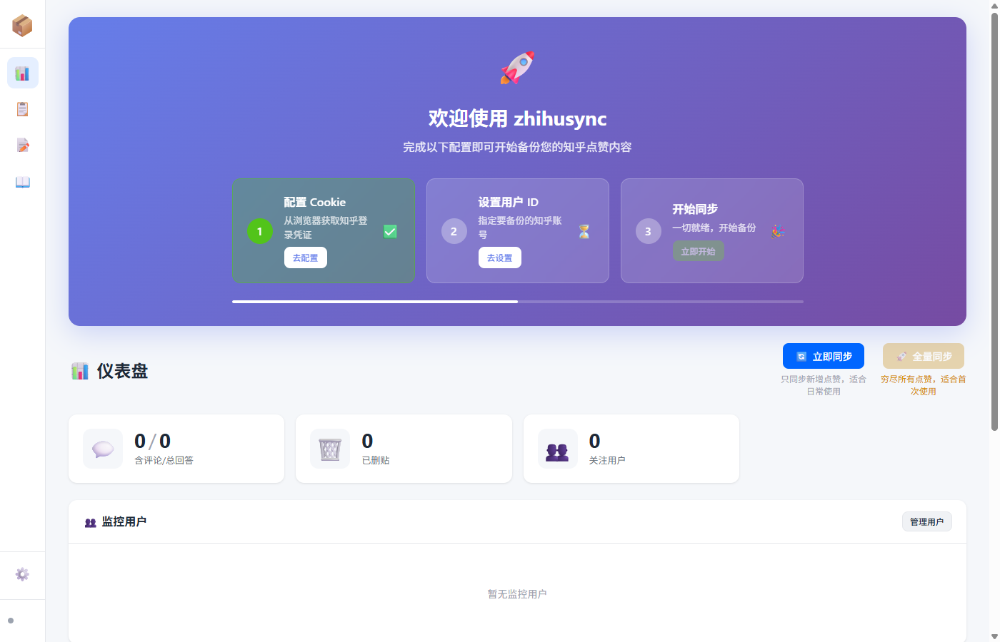

<div align="center">

# 🔄 zhihusync

**自动备份知乎点赞内容，防止珍贵回答丢失**

[](https://www.python.org/)
[](https://fastapi.tiangolo.com/)
[](https://www.docker.com/)
[](LICENSE)

[English](README_EN.md) | 简体中文

</div>

## 🚀 快速开始

### 一键安装

```bash
# Linux / macOS / WSL2
curl -fsSL https://raw.githubusercontent.com/nevertiree/zhihusync/master/install.sh | bash

# Windows (PowerShell)
irm https://raw.githubusercontent.com/nevertiree/zhihusync/master/install.ps1 | iex
```

安装完成后访问 **http://localhost:6067**

<details>
<summary>🐳 手动 Docker 部署</summary>

```bash
# 使用 Docker Hub 镜像
docker run -d \
  --name zhihusync \
  -p 6067:6067 \
  -v ~/zhihusync/data:/app/data \
  nevertiree26/zhihusync:latest

# 或使用 docker-compose
docker compose up -d
```
</details>

## ✨ 功能特性

| 功能 | 描述 |
|------|------|
| 🌐 **Web 界面** | 可视化配置和管理，无需命令行 |
| 💾 **自动备份** | 定时同步点赞内容到本地 HTML |
| 🔍 **全文搜索** | 快速查找已备份的回答 |
| 🖼️ **图片下载** | 自动下载图片到本地 |
| 🔄 **增量更新** | 只同步新内容，避免重复 |

## 📖 使用文档

| 文档 | 说明 |
|------|------|
| [安装指南](docs/INSTALL.md) | 详细安装方式（Docker/本地运行） |
| [配置指南](docs/CONFIG.md) | Cookie 获取、用户 ID 设置 |
| [常见问题](docs/FAQ.md) | Cookie 有效期、多账号等 |
| [API 文档](docs/API.md) | REST API 接口说明 |
| [Docker 构建](docs/docker/DOCKER_BUILD_GUIDE.md) | 镜像构建指南 |

## 📸 界面预览




更多截图见 [docs/images/](docs/images/)

## 🗑️ 卸载

```bash
# Linux / macOS / WSL2
curl -fsSL https://raw.githubusercontent.com/nevertiree/zhihusync/master/uninstall.sh | bash

# Windows (PowerShell)
irm https://raw.githubusercontent.com/nevertiree/zhihusync/master/uninstall.ps1 | iex
```

## 📂 项目结构

```
zhihusync/
├── data/           # 数据目录
│   ├── html/      # 备份的 HTML 文件
│   ├── meta/      # 数据库和日志
│   └── static/    # 图片等资源
├── config/        # 配置文件
└── src/           # 源代码
```

## 📚 相关文档

- [CHANGELOG.md](CHANGELOG.md) - 版本更新记录
- [VERSION.md](VERSION.md) - 版本管理规范
- [AGENTS.md](AGENTS.md) - 开发规范

## 📄 许可证

[MIT License](LICENSE) © 2026 zhihusync

---

<div align="center">

**Star 🌟 如果这个项目对你有帮助！**

</div>
